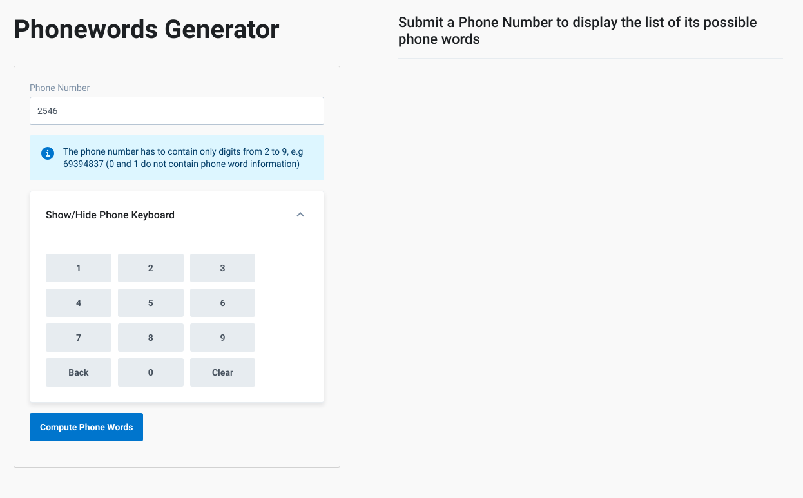
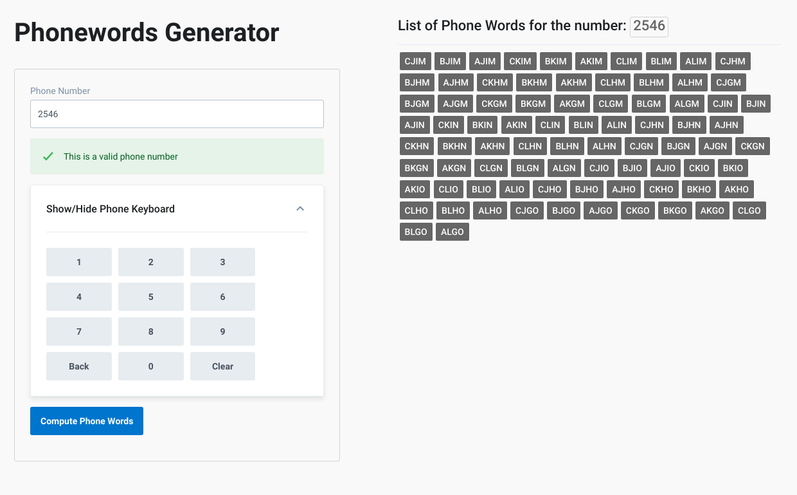

# Phonewords Generator Full Stack

Generator of Phonewords, Full Stack with containerized services for backend (Python API or Node API) and Frontend (Javascript application with React)




## Description

This application is a converter from phone numbers to [phonewords](https://en.wikipedia.org/wiki/Phoneword). You can input a phone and it will give you a list of all the possible phonewords for that specific phone number.

The frontend has validation, checking that the phone number are only integers (2-9) digits and/or spaces, is not empty and maximum length 6, and shows all the corresponding phone words in a list that also checks if there are no words matching or something went wrong with the request.

The backend is a documented, tested **API developed with Python and Flask** that exposes an endpoint that given a number returns all the possible phonewords for that number, it checks for valid numbers and possible errors.

An equivalent **Node API** built with Express is also available, but it has no documentation.

It is all bundled using Docker with containers for the backend and frontend that are working together in a system using docker compose.

To run, simply execute:

```
docker-compose up
```

if you want to switch backends between node and python (default is Python), just change the backend build directory on the `docker-compose.yml` file

```python
backend:
    build: ./backend-python # or ./backend-node
```

and run 

```
docker-compose build
docker-compose up
```

The **Front End** will be available at `localhost:4200`, and the **Backend** API (default route is the documentation page for the Python API), at `localhost:5000`

## Frontend

The Frontend uses:

- React 16.x
- Typescript
- Parcel Bundler
- Kiwi.com Orbit Components
- Cypress
- Styled Components (Responsive layout)
- Formik
- Enzyme + Jest (Unit Testing)

To start fiddling with it, just run in `/frontend` the Docker Image

```
docker build . -t phoneword_frontend
docker run -d -p 4200:80 phoneword_frontend
```

the application will be available at port `4200` on `localhost`.
Alternatively, you can do it without docker:

```
npm install
```

and then 

```
npm run dev
``` 

to build run 
```
npm run build
```

To run the tests
```
npm run test
```

## Python Backend


*Documentation screenshot*


The Python Backend uses:

- Python 3.5
- Flask, Flask RESTFul
- Swagger for documentation
- PyTest

To build and run a `Docker image` is implemented from a Dockerfile:

```
docker build . -t phoneword_backend
docker run -d -p 5000:5000 phoneword_backend
```

Your API is running at `localhost:5000`. You can access it via `/api/v1/phonewords/` or go to `/docs` for documentation

Without docker, to build navigate to `/backend-python` then install the requirements

```
pip install -r requirements.txt
```

and run the API by running

```
python app.py
```

To test, run

```
python -m pytest
```

## Node Backend

The Node Backend uses

- Node 8
- ExpressJS
- Mocha + Chai

To build and run a `Docker image` is implemented from a Dockerfile:

```
docker build . -t phoneword_backend
docker run -d -p 5000:5000 phoneword_backend
```

Your API is running at `localhost:5000`. You can access it via `/api/v1/phonewords/` 

Without docker, to build navigate to `/backend-node` and run

```
npm install

```

finally, start the API by running

```
npm run dev
```

To test just run

```
npm run test
```
